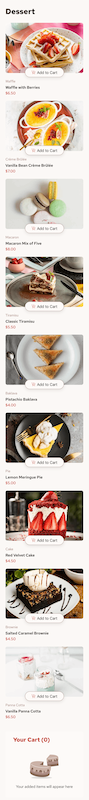

# Frontend Mentor - Product list with cart solution

This is a solution to the [Product list with cart challenge on Frontend Mentor](https://www.frontendmentor.io/challenges/product-list-with-cart-5MmqLVAp_d).

## Table of contents

-  [Overview](#overview)
   -  [The challenge](#the-challenge)
   -  [Screenshot](#screenshot)
   -  [Links](#links)
-  [My process](#my-process)
   -  [Built with](#built-with)
   -  [What I learned](#what-i-learned)
-  [Author](#author)
-  [Acknowledgments](#acknowledgments)

## Overview

### The challenge

Users should be able to:

-  Add items to the cart and remove them
-  Increase/decrease the number of items in the cart
-  See an order confirmation modal when they click "Confirm Order"
-  Reset their selections when they click "Start New Order"
-  View the optimal layout for the interface depending on their device's screen size
-  See hover and focus states for all interactive elements on the page

### Screenshot




### Links

-  [Solution URL](https://github.com/Bri-elle/FEM-Product-list-with-cart.git)
-  [Live Site URL](https://fem-product-list-with-cart-nu.vercel.app)

## My process

### Built with

-  HTML5
-  CSS
-  Flexbox
-  CSS Grid
-  Javascript
-  Mobile-first workflow

### What I learned

This project helped me learn:

-  how to load html data dynamically using javascript.
-  how to make a webpage more interactive.

```js
document.addEventListener("DOMContentLoaded", function () {
	fetch("data.json")
		.then((response) => response.json())
		.then((data) => {});
});
```

-  Frontend Mentor - [@Bri-elle](https://www.frontendmentor.io/profile/Bri-elle)
